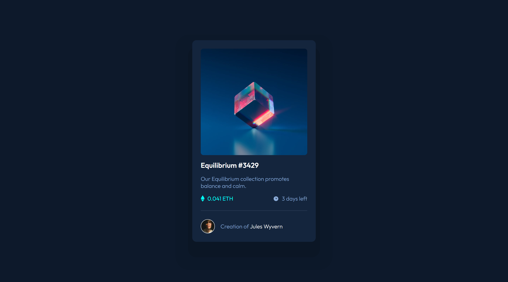
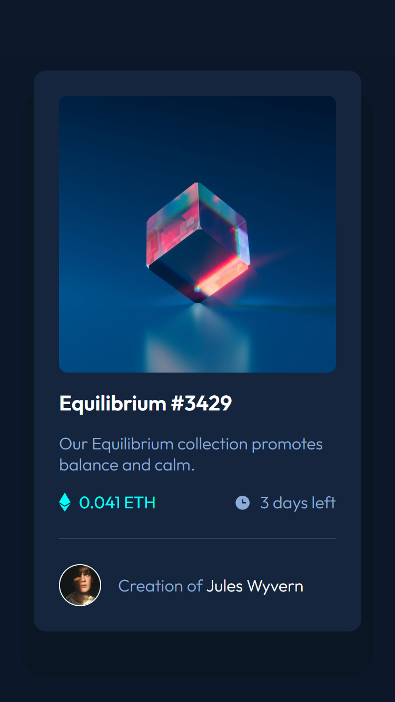

# Frontend Mentor - NFT preview card component solution

This is a solution to the [NFT preview card component challenge on Frontend Mentor](https://www.frontendmentor.io/challenges/nft-preview-card-component-SbdUL_w0U). Frontend Mentor challenges help you improve your coding skills by building realistic projects.

## Table of contents

- [Overview](#overview)
  - [The challenge](#the-challenge)
  - [Screenshot](#screenshot)
  - [Links](#links)
- [My process](#my-process)
  - [Built with](#built-with)
- [Author](#author)

## Overview

### The challenge

Users should be able to:

- View the optimal layout depending on their device's screen size
- See hover states for interactive elements

### Screenshot

### Links

- Solution URL: [Frontend Mentor](https://www.frontendmentor.io/solutions/nft-preview-card-component-JJD-hJiT0T)
- Live Site URL: [NFT Card](https://nft-preview-mohamedagina.vercel.app/)

## My process

### Built with

- Semantic HTML5 markup
- CSS3
- Flexbox

## Author

- Frontend Mentor - [@mohamedagina](https://www.frontendmentor.io/profile/mohamedagina)
- Linkedin - [@mohamedagina](https://www.linkedin.com/in/mohamed-agina/)
